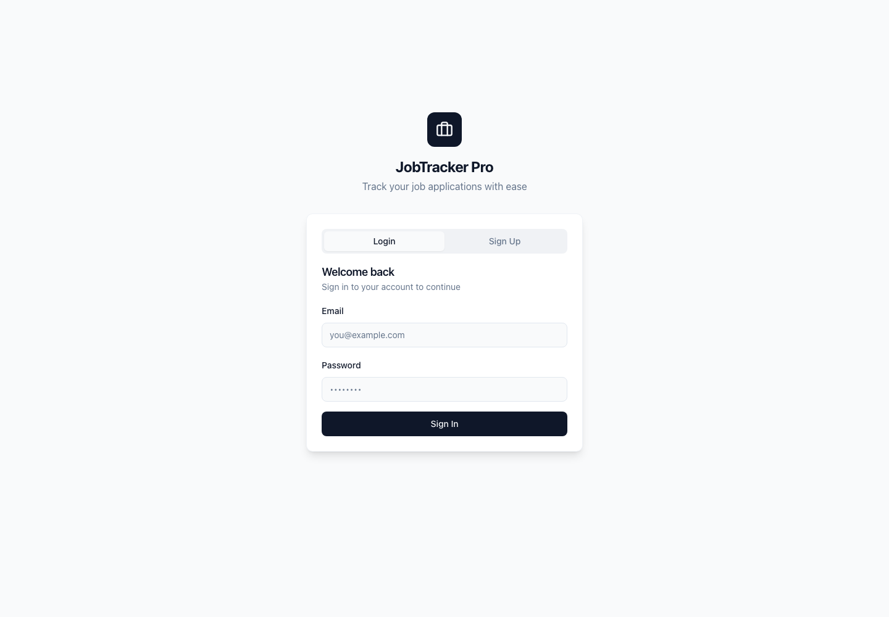

# JobTrackr

JobTrackr is a full-stack job application tracker for organizing applications, monitoring interview progress, and comparing a resume against a job description. I built it to make the job search less scattered by keeping applications, statuses, deadlines, and resume feedback in one focused dashboard.

## Visuals



## Tech Stack

- React 18
- TypeScript
- Vite
- Tailwind CSS
- shadcn/ui and Radix UI
- TanStack Query
- React Router
- Express
- SQLite with better-sqlite3
- JWT authentication
- Vitest

## Features

- Email/password sign up and login with JWT-based session handling.
- Protected application dashboard for authenticated users.
- Job application CRUD flow for adding, editing, and deleting applications.
- Status tracking for saved, applied, online assessment, interview, offer, and rejected applications.
- Dashboard summary cards showing total applications and counts by status.
- Upcoming interview list based on scheduled interview dates.
- Resume-to-job-description match analyzer with match score, overlapping keywords, missing keywords, and improvement tips.
- Responsive sidebar layout with desktop and mobile navigation.
- Local SQLite database setup for quick development without external services.

## Installation

Clone the repository:

```sh
git clone https://github.com/nkanthed06/JobTrackr.git
cd JobTrackr
```

Install frontend dependencies:

```sh
npm install
```

Install backend dependencies:

```sh
cd backend
npm install
```

Create the local SQLite database:

```sh
npm run init-db
```

Optional: create a backend environment file for a custom JWT secret or port.

```sh
cat > .env <<'EOF'
JWT_SECRET=replace-this-with-a-long-random-secret
PORT=3001
EOF
```

## Usage

Start the backend API from the `backend` folder:

```sh
npm start
```

In a second terminal, start the frontend from the project root:

```sh
npm run dev
```

Open the app in your browser:

```txt
http://127.0.0.1:8080
```

After opening the app:

1. Create an account or sign in.
2. Add job applications from the Applications page.
3. Update each application's status as you move through the hiring process.
4. Use the Dashboard page to review totals and upcoming interviews.
5. Paste a resume and job description into Resume Match to generate a keyword-based match score.

## Available Scripts

Frontend scripts from the project root:

```sh
npm run dev
npm run build
npm run preview
npm run lint
npm test
```

Backend scripts from `backend/`:

```sh
npm run init-db
npm run dev
npm start
```

## Project Structure

```txt
JobTrackr/
├── backend/                 # Express API, SQLite setup, and auth/application endpoints
├── docs/screenshots/        # README screenshots
├── public/                  # Static assets
├── src/components/          # App components and shadcn/ui primitives
├── src/contexts/            # Auth context
├── src/hooks/               # Shared React hooks
├── src/lib/                 # API client and utility helpers
├── src/pages/               # Route-level pages
├── src/test/                # Vitest setup and tests
└── supabase/                # Alternate Supabase schema migration
```

## License

This project is licensed under the MIT License. See [LICENSE](LICENSE) for details.
